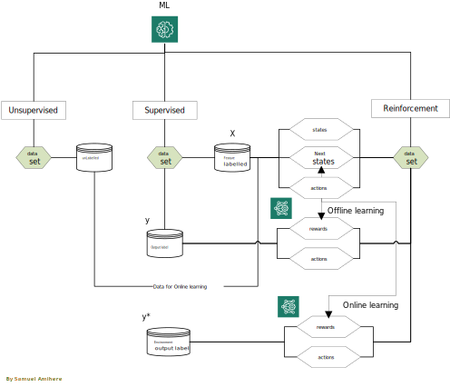

# **Understanding Machine Learning Datasets: A Classification Guide**
## Introduction
Machine learning (ML) has revolutionized the way we approach data analysis, automation, and decision-making. With its ability to learn from data and improve over time, ML has become a crucial tool in various industries, from healthcare and finance to marketing and transportation. However, the success of ML models relies heavily on the quality and type of data used for training. In fact, the adage "garbage in, garbage out" is particularly relevant in ML, where poor data quality or incorrect dataset classification can lead to biased, inaccurate, or even harmful models.
One of the fundamental steps in ML model development is understanding the type of dataset required for training. This involves classifying datasets into distinct categories, each with its unique characteristics, advantages, and challenges. In this article, we will delve into the world of ML datasets, exploring the differences between unsupervised, supervised, and reinforcement learning datasets. We will examine the characteristics of each dataset type, including unlabeled, and labeled (feature and output labeled) datasets, and discuss how they are used in various ML paradigms. By grasping these concepts, you will gain a deeper understanding of how to select, prepare, and utilize datasets for effective ML model training.
 

## Unsupervised Learning
Unsupervised learning is a type of machine learning where algorithms are trained on datasets without explicit labels or annotations. In this scenario, the model learns to identify patterns, relationships, and structure within the data on its own, without prior knowledge of the expected output. Unsupervised learning is particularly useful for:
- Exploratory data analysis: Uncovering hidden patterns, trends, and correlations within large datasets.
- Anomaly detection: Identifying unusual or outlier data points that deviate from the norm.
- Clustering: Grouping similar data points into clusters based on their characteristics.
- Dimensionality reduction: Reducing the number of features or variables in a dataset while preserving essential information.

### Unlabeled dataset for unsupervised learning
In unsupervised learning, the dataset is typically unlabeled. No explicit labels or annotations are provided, allowing the model to learn from the data itself.

Unsupervised learning algorithms include:
- K-means clustering
- Hierarchical clustering
- Principal Component Analysis (PCA)
- t-Distributed Stochastic Neighbor Embedding (t-SNE), etc.
By leveraging unsupervised learning techniques, organizations can gain valuable insights from their data, identify areas for improvement, and develop more effective strategies for data-driven decision-making.

## Supervised Learning
Supervised learning is a type of machine learning where algorithms are trained on labelled datasets, meaning the data is accompanied by explicit labels or annotations that indicate the expected output. In this scenario, the model learns to map inputs to outputs based on the labeled examples, enabling it to make predictions on new, unseen data. Supervised learning is particularly useful for:
- Classification: Predicting categorical labels or classes, such as spam vs. non-spam emails.
- Regression: Predicting continuous values or numerical outputs, such as stock prices or temperatures.
- Image recognition: Identifying objects, scenes, or activities within images, etc.

### Labeled dataset for supervised learning
In supervised learning, the dataset is typically labeled. Explicit labels or annotations are provided, allowing the model to learn from the data and expected outputs.

### Output dataset for unsupervised learning
The predicted outputs or outcomes generated by the trained model.

Supervised learning algorithms include:
- Linear Regression
- Logistic Regression
- Decision Trees
- Random Forest
- Support Vector Machines (SVM)
- Neural Networks, etc.

The supervised learning process involves:
- Data collection and labeling
- Data preprocessing and feature engineering
- Model selection and training
- Model evaluation and validation
- Deployment and prediction
- By leveraging supervised learning techniques, organizations can develop accurate predictive models, automate
- decision-making processes, and drive business value from their data.

## Reinforcement Learning (RL)
Reinforcement learning is a type of machine learning where agents learn to make decisions by interacting with an environment and receiving feedback in the form of rewards or penalties. As shown in the diagram (Figure 1), RL datasets can be classified into two categories based on whether the learning activity is being performed online or offline:
1. ### Dataset for Online Learning (Unsupervised):
In online learning, the dataset is unlabeled, meaning that the output label is not explicitly specified. Instead, the environment determines the feedback in the form of rewards or penalties, as shown in Figure 1. This type of learning is unsupervised because the agent learns from its interactions with the environment without explicit guidance. The trainer provides the unlabeled datasets, states <i>st</i>, and actions <i>at</i> (<i>st, at</i>),  to train the agent on. In this scenario, the dataset consists of experiences, made up of  <i>st</i>,<i>at</i>, and <i>Rt</i> at time <i>t</i>, where <i>Rt is provided by the environment in the form of rewards or penalties. So, the agent learns to map states to actions through trial and error, without explicit labels or supervision.
The goal is to learn a policy π through value iteration, shown in the equation below, that maximizes cumulative rewards over time.

$$
V(s_t) = \max_{\pi} \left\{ R_t(s_t, a_t) + \gamma \mathbb{E} \left( V(s_{t+1}) \mid s_t, a_t \right) \right\}
$$

For example, consider an agent learning to play a game like chess or Go. The dataset would consist of game states, moves, and rewards (e.g., winning or losing). The environment (the game) provides feedback in the form of rewards, and the agent learns to make moves that maximize its chances of winning.
	By learning from unlabeled data and environmental feedback, the agent can develop complex strategies and adapt to new situations, much like humans do through experience and experimentation.

2. ### Dataset for Offline Learning (Supervised):
In offline learning, the dataset is labeled, meaning that the output label is explicitly specified. This type of learning is supervised because the agent learns from a pre-collected dataset of experiences, with explicit guidance from the labeled data done by experts. The trainer provides the feature labeled dataset, consisting of s_t, a_t, and s_(t+1), and the output labeled dataset R_t and associated actions a_t (maybe omitted at times. Only necessary for imitation learning or behavior cloning to supervise the learning process). The dataset is typically collected from expert demonstrations, simulations, or previous experiences. By learning from labeled data, the agent can develop complex strategies and adapt to new situations, leveraging the knowledge and experience of the experts who generated the dataset.

RL algorithms include:
- Q-learning
- SARSA
- Deep Q-Networks (DQN)
- Policy Gradients
- Actor-Critic Methods

## Conclusion
Understanding the classification of ML datasets is crucial for effective model training. By recognizing the differences between unlabeled, labelled (feature and output label datasets), you can choose the right approach for your ML project. Whether you are working with unsupervised, supervised, or reinforcement learning, this guide will help you navigate the world of ML datasets with confidence, especially in the case of RL.
